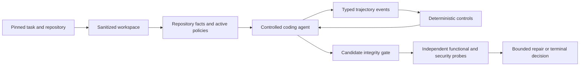

# PGACS Secure Repository Completion Prototype

This branch contains the active prototype of the **Policy-Guided Agent Control
System (PGACS)** for secure repository-level code completion. It uses Archon as
the host platform and currently targets three masked C/C++ tasks from
SecRepoBench.

Start here for development. Prior proposals, superseded designs, selector
experiments, BaxBench work, and generated historical artifacts are preserved in
[`archive/`](archive/README.md), but they are not normative for this branch.

## Understand It in Five Minutes

PGACS mediates a coding agent while it completes one security-sensitive region
in a real repository. It does more than scan the final patch:

1. Materialize a sanitized repository without upstream fixes or benchmark
   labels.
2. Extract bounded, security-relevant repository facts.
3. Select and activate repository-derived policy obligations.
4. Give the agent only controlled repository read/search and target-edit tools.
5. Normalize agent actions into trajectory evidence and enforce deterministic
   scope controls.
6. Admit only a target-scoped candidate with an intact protected tree.
7. Evaluate functionality and security independently in pinned SecRepoBench
   containers.
8. Permit at most one obligation-specific repair in C2/C3.
9. Produce a deterministic terminal decision and auditable evidence ledger.



The central research hypothesis is that security-relevant agent behavior can be
observed and conditioned before it becomes an insecure artifact. Repository
facts, trajectory signals, and evaluator outcomes remain separate to avoid
circular evaluation.

## Active Documentation

| Document | Use it for |
| --- | --- |
| [Current runbook](current-secrepobench/README.md) | Scope, experiment conditions, status, commands, and immediate next steps |
| [Technical design](current-secrepobench/technical-design.md) | Normative contracts, trust boundaries, event model, failure semantics, and design decisions |
| [Feasibility results](current-secrepobench/feasibility-results.md) | Frozen three-task results, findings, limitations, and claim boundary |
| [Archive index](archive/README.md) | Retrieving prior designs, datasets, experiments, and generated evidence |

The technical design is normative and the current runbook operationalizes it.
The implementation must conform to both; treat a mismatch as a defect to
resolve explicitly. Treat archived documents only as provenance.

## Experiment Conditions

All PGACS conditions use the same sanitized workspace, restricted agent
capabilities, evaluator, and integrity checks.

| Condition | Policy guidance | Terminal security gate | Repair / trajectory conditioning |
| --- | --- | --- | --- |
| C0 | neutral | observe only | none |
| C1 | repository-derived | observe only | none |
| C2 | repository-derived | enforce | one evaluator-bound repair |
| C3 | repository-derived | enforce | C2 plus trajectory conditioning |

B0 is an external native-agent reference. It is not an Archon/PGACS condition
and must not be interpreted as a treatment contrast with C0-C3.

## Code Structure

The PGACS prototype is intentionally implemented as research scripts rather
than production Archon packages.

| Area | Primary files |
| --- | --- |
| Task schema and redacted views | `scripts/pgacs-task-adapters.ts`, `scripts/pgacs-task-adapter-cli.ts` |
| Sample preparation | `scripts/prepare-pgacs-secrepobench-samples.ts` |
| Workspace sanitization | `scripts/pgacs-secrepobench-materializer.ts` |
| Candidate and region integrity | `scripts/pgacs-secrepobench-candidate.ts` |
| Repository facts and policy activation | `scripts/pgacs-secrepobench-policy.ts` |
| Trajectory events and predicates | `scripts/pgacs-secrepobench-trajectory.ts` |
| C0-C3 controller and evidence ledger | `scripts/pgacs-secrepobench-controller.ts` |
| Claude adapter | `scripts/pgacs-secrepobench-claude-driver.ts` |
| OpenHands adapter | `scripts/pgacs-secrepobench-openhands-driver.ts` |
| Restricted OpenHands bridge | `scripts/openhands/` |
| Evaluator adapter and typed results | `scripts/pgacs-secrepobench-evaluation.ts`, `scripts/pgacs-secrepobench-official-evaluator.ts` |
| Frozen Python oracle | `scripts/secrepobench/pgacs_secrepobench_oracle.py` |
| Calibration | `scripts/calibrate-pgacs-secrepobench.ts` |
| Experiment entry point | `scripts/run-pgacs-secrepobench.ts` |
| Tests | adjacent `*.test.ts` files and `scripts/openhands/test_pgacs_workspace_policy.py` |

Generated workspaces and run artifacts use ignored `.pgacs-*` directories.
They are evidence from a particular execution, not source files.

## Current Status

Implemented and validated:

- sanitized, history-free repository materialization;
- structural generation/evaluator information separation;
- exact candidate byte envelope and protected-tree integrity;
- bounded C/C++ repository facts and policy obligations;
- typed trajectory events and deterministic control predicates;
- C0-C3 execution with one bounded C2/C3 repair;
- pinned task-specific functional and OSS-Fuzz evaluation;
- Claude and OpenHands agent adapters;
- OpenHands with Qwen through Hugging Face's OpenAI-compatible router;
- bridge protocol `1.1` with explicit cost availability and budget-enforcement
  receipts; and
- result schema `0.5.0`.

The three-task, 12-cell Claude feasibility study is complete. It demonstrates
mechanism feasibility and security-first blocking, not population-level
effectiveness. The OpenHands/Qwen route has passed a restricted live smoke task
and is pinned for the next qualification run to Scaleway through Hugging Face,
but has not yet produced a SecRepoBench benchmark result.

## Development Setup

Prerequisites:

- Bun and the repository dependencies;
- Docker for task-specific ARVO evaluator images;
- Python 3.13 and `uv` for OpenHands; and
- a funded model-provider credential supplied only through the environment.

```bash
bun install
bun run pgacs:doctor

uv venv --python 3.13 .pgacs-openhands
uv pip install --python .pgacs-openhands/bin/python \
  -r scripts/openhands/requirements.txt
```

Never place API keys in a request, manifest, artifact, or committed environment
file. Supported variables include `ANTHROPIC_API_KEY`, `OPENAI_API_KEY`,
`HF_TOKEN`, and the explicit generic pair `LLM_API_KEY`/`LLM_BASE_URL`.
`pgacs:doctor` is an offline, non-mutating preflight. It reports offline
development and live OpenHands experiment readiness separately, never prints
credential or pricing values, and supports `--json` for agent-readable output.

Run focused validation while editing:

```bash
bun test ./scripts/pgacs-secrepobench-candidate.test.ts \
  ./scripts/pgacs-secrepobench-controller.test.ts \
  ./scripts/pgacs-secrepobench-openhands-driver.test.ts

cd scripts/openhands
OPENHANDS_SUPPRESS_BANNER=1 ../../.pgacs-openhands/bin/python \
  -m unittest test_pgacs_workspace_policy.py
```

Before handing off or committing:

```bash
bun run validate
git diff --check
```

Preparation, calibration, and experiment commands are kept in the
[current runbook](current-secrepobench/README.md#8-commands). Use a fresh output
directory for every experiment.

## Continuing with Codex

Give Codex this initial instruction:

```text
Continue the PGACS SecRepoBench prototype on the current branch. First read
AGENTS.md, principle-guided-agent-research/README.md,
principle-guided-agent-research/current-secrepobench/README.md, and
principle-guided-agent-research/current-secrepobench/technical-design.md. Inspect
git status before editing. Treat principle-guided-agent-research/archive as
historical evidence, not the current specification. Preserve generation/evaluator
separation, deterministic enforcement, candidate integrity, and typed failure
semantics. Run focused tests and bun run validate before reporting completion.
```

Development rules for humans and agents:

1. Read the implementation before proposing a new abstraction.
2. Do not expose CWE labels, PoCs, developer fixes, or hidden evaluator output
   to generation or repair.
3. Do not count refusal or non-submission as secure unless an independent probe
   identifies the relevant security failure.
4. Keep model/agent runtime changes separate from PGACS treatment changes.
5. Version any result or bridge contract whose meaning or required fields
   change.
6. Preserve old experiment artifacts; add new runs in fresh directories.
7. Update the technical design and runbook whenever implementation semantics
   change.

## Next Development Steps

The immediate task is to qualify the OpenHands/Qwen path on task 910 using
`openai/Qwen/Qwen3.6-35B-A3B:scaleway`. It is complete only when all of the
following acceptance criteria hold:

- `bun run pgacs:doctor` reports `Offline development: READY` and
  `Live OpenHands experiment: READY`;
- the provider route, exact model identifier, OpenHands versions, and explicit
  input/output token rates are recorded in the run receipt;
- one fresh C0 run completes with target-only edits and an intact protected
  tree;
- independent functional and security probes reach typed terminal outcomes;
- the transcript digest, normalized trajectory, candidate digest, evaluator
  receipts, timing, and cost-accounting status are present; and
- focused tests, `bun run validate`, and `git diff --check` pass.

After that qualification:

1. Move C3 from a post-write reminder to a pre-edit, evidence-triggered
   conditioning point.
2. Add per-probe timing and freeze the next result-schema revision.
3. Run at least three independent generations per condition before making an
   effectiveness claim.
4. Expand beyond three tasks only after the small protocol is stable and the
   analysis plan is preregistered.

## Claim Boundary

This branch can support claims about prototype feasibility, deterministic
control behavior, candidate integrity, and outcomes on the frozen three-task
study. It cannot yet support claims of general secure-code-generation
improvement, broad SecRepoBench performance, or superiority across agents and
models.
