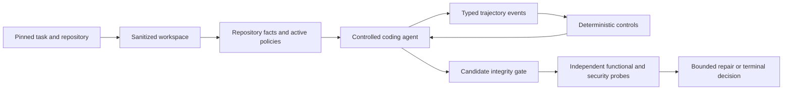

# PGACS Secure Repository Completion Prototype

This branch contains the active prototype of the **Policy-Guided Agent Control
System (PGACS)** for secure repository-level code completion. It uses Archon as
the host platform and currently targets three masked C/C++ tasks from
SecRepoBench.

Start here for development. Prior proposals, superseded designs, selector
experiments, BaxBench work, and generated historical artifacts are preserved in
[`archive/`](archive/README.md), but they are not normative for this branch.

## Understand It in Five Minutes

PGACS mediates a coding agent while it completes one security-sensitive region
in a real repository. It does more than scan the final patch:

1. Materialize a sanitized repository without upstream fixes or benchmark
   labels.
2. Extract bounded, security-relevant repository facts.
3. Select and activate repository-derived policy obligations.
4. Give the agent only controlled repository read/search and target-edit tools.
5. Normalize agent actions into trajectory evidence and enforce deterministic
   scope controls; apply security-behavior controls only when the task exposes a
   prospectively admitted intervention point.
6. Admit only a target-scoped candidate with an intact protected tree.
7. Evaluate functionality and security independently in pinned SecRepoBench
   containers.
8. Permit at most one obligation-specific repair in C2/C3.
9. Produce a deterministic terminal decision and auditable evidence ledger.



The central research hypothesis is that security-relevant agent behavior can be
observed and conditioned before it becomes an insecure artifact. That mechanism
is tested on a separate trajectory-rich task track. SecRepoBench tests prompt
guidance, candidate integrity, independent artifact enforcement, and repair;
ordinary masked-completion results are not treated as trajectory-control
evidence. Repository facts, trajectory signals, and evaluator outcomes remain
separate to avoid circular evaluation.

## Active Documentation

| Document | Use it for |
| --- | --- |
| [Current runbook](current-secrepobench/README.md) | Scope, experiment conditions, status, commands, and immediate next steps |
| [Technical design](current-secrepobench/technical-design.md) | Normative contracts, trust boundaries, event model, failure semantics, and design decisions |
| [Trajectory-control protocol](current-trajectory/README.md) | Normative task admission, C2/C3 mechanism contrast, evidence contract, metrics, and pilot gates |
| [Trajectory candidate audit](current-trajectory/candidate-audit.md) | Historical screening, prospective redacted sample, rejected alternatives, and remaining admission gates |
| [Feasibility results](current-secrepobench/feasibility-results.md) | Frozen three-task results, findings, limitations, and claim boundary |
| [OpenHands/Qwen task-910 results](current-secrepobench/openhands-qwen-task910-results.md) | C0-C3 qualification, candidate and trajectory comparison, incidents, and causal limits |
| [Archive index](archive/README.md) | Retrieving prior designs, datasets, experiments, and generated evidence |

The technical design is normative and the current runbook operationalizes it.
The implementation must conform to both; treat a mismatch as a defect to
resolve explicitly. Treat archived documents only as provenance.

## Evaluation Tracks

All PGACS conditions use the same sanitized workspace, restricted agent
capabilities, evaluator, and integrity checks.

| Condition | Policy guidance | Terminal security gate | Repair / trajectory conditioning |
| --- | --- | --- | --- |
| C0 | neutral | observe only | none |
| C1 | repository-derived | observe only | none |
| C2 | repository-derived | enforce | one evaluator-bound repair |
| C3 | repository-derived | enforce | C2 plus trajectory conditioning |

B0 is an external native-agent reference. It is not an Archon/PGACS condition
and must not be interpreted as a treatment contrast with C0-C3.

SecRepoBench's primary within-harness contrasts are C0/C1/C2: guidance and
artifact enforcement are added incrementally. C3 remains implemented and may be
run as an exploratory mechanism check, but `C2 -> C3` is interpreted as online
trajectory control only on tasks admitted by the
[trajectory-control protocol](current-trajectory/README.md). A run with no
eligible intervention opportunity records the mechanism as not exercised.

## Code Structure

The PGACS prototype is intentionally implemented as research scripts rather
than production Archon packages.

| Area | Primary files |
| --- | --- |
| Task schema and redacted views | `scripts/pgacs-task-adapters.ts`, `scripts/pgacs-task-adapter-cli.ts` |
| Sample preparation | `scripts/prepare-pgacs-secrepobench-samples.ts` |
| Workspace sanitization | `scripts/pgacs-secrepobench-materializer.ts` |
| Candidate and region integrity | `scripts/pgacs-secrepobench-candidate.ts` |
| Repository facts and policy activation | `scripts/pgacs-secrepobench-policy.ts` |
| Trajectory events and predicates | `scripts/pgacs-secrepobench-trajectory.ts` |
| Trajectory-task admission | `scripts/pgacs-trajectory-task-admission.ts` |
| Outcome-blind trajectory candidate selection | `scripts/select-pgacs-trajectory-candidates.ts` |
| C0-C3 controller and evidence ledger | `scripts/pgacs-secrepobench-controller.ts` |
| Claude adapter | `scripts/pgacs-secrepobench-claude-driver.ts` |
| OpenHands adapter | `scripts/pgacs-secrepobench-openhands-driver.ts` |
| Restricted OpenHands bridge | `scripts/openhands/` |
| Evaluator adapter and typed results | `scripts/pgacs-secrepobench-evaluation.ts`, `scripts/pgacs-secrepobench-official-evaluator.ts` |
| Frozen Python oracle | `scripts/secrepobench/pgacs_secrepobench_oracle.py` |
| Calibration | `scripts/calibrate-pgacs-secrepobench.ts` |
| Qualification receipt | `scripts/pgacs-secrepobench-qualification.ts`, `current-secrepobench/evidence/` |
| Experiment entry point | `scripts/run-pgacs-secrepobench.ts` |
| Tests | adjacent `*.test.ts` files and `scripts/openhands/test_pgacs_workspace_policy.py` |

Generated workspaces and run artifacts use ignored `.pgacs-*` directories.
They are evidence from a particular execution, not source files. A current
qualification receipt additionally binds the native-amd64 Docker host and each
evaluator's content-addressed image ID and immutable repository digest. The
tracked schema-0.1 receipt predates those fields and is retained only as
historical evidence until native requalification replaces it with schema 0.2.

## Current Status

Implemented and validated:

- sanitized, history-free repository materialization;
- structural generation/evaluator information separation;
- exact candidate byte envelope and protected-tree integrity;
- bounded C/C++ repository facts and policy obligations;
- typed trajectory events and deterministic control predicates;
- C0-C3 execution with one bounded C2/C3 repair;
- pinned task-specific functional and OSS-Fuzz evaluation;
- Claude and OpenHands agent adapters;
- OpenHands with Qwen through Hugging Face's OpenAI-compatible router;
- bridge protocol `2.0` with synchronous TypeScript-controller decisions,
  explicit cost availability, budget enforcement, and treatment receipts;
- C3 target-write deferral until successful target and non-target repository
  observations are recorded;
- oracle v0.6 with per-probe duration metadata;
- result schema `0.6.0`; and
- a tracked historical source-digest-bound receipt for the 18/18 oracle
  calibration; native-amd64, immutable-image-digest requalification is pending.

The three-task, 12-cell Claude feasibility study is complete. It demonstrates
prototype feasibility and security-first blocking, not population-level
effectiveness. The OpenHands/Qwen route completed one task-910 C0-C3 engineering
qualification on the pinned Scaleway route through Hugging Face under the prior
protocol and adapter-local predicate. Those outcomes qualify the historical
integration but not the protocol-2.0 trajectory-control mechanism. Repeated
C0/C1/C2 runs from one committed revision remain
necessary for a SecRepoBench effectiveness claim; trajectory effectiveness
requires separately admitted tasks.

## Development Setup

Prerequisites:

- Bun and the repository dependencies;
- Docker for task-specific ARVO evaluator images;
- Python 3.13 and `uv` for OpenHands; and
- a funded model-provider credential supplied only through the environment.

```bash
bun install
bun run pgacs:doctor

uv venv --python 3.13 .pgacs-openhands
uv pip install --python .pgacs-openhands/bin/python \
  -r scripts/openhands/requirements.txt
```

`pgacs:doctor` must report offline development as ready. Live readiness and
`bun run pgacs:qualification:check` intentionally remain blocked while the
tracked receipt is historical; follow the native qualification procedure in
the current runbook before running new benchmark cells.

Never place API keys in a request, manifest, artifact, or committed environment
file. Supported variables include `ANTHROPIC_API_KEY`, `OPENAI_API_KEY`,
`HF_TOKEN`, and the explicit generic pair `LLM_API_KEY`/`LLM_BASE_URL`.
`pgacs:doctor` is an offline, non-mutating preflight. It reports offline
development and live OpenHands experiment readiness separately, never prints
credential or pricing values, and supports `--json` for agent-readable output.

Run focused validation while editing:

```bash
bun test ./scripts/pgacs-secrepobench-candidate.test.ts \
  ./scripts/pgacs-secrepobench-controller.test.ts \
  ./scripts/pgacs-secrepobench-openhands-driver.test.ts

cd scripts/openhands
OPENHANDS_SUPPRESS_BANNER=1 ../../.pgacs-openhands/bin/python \
  -m unittest test_pgacs_workspace_policy.py
```

Before handing off or committing:

```bash
bun run validate
git diff --check
```

Preparation, calibration, and experiment commands are kept in the
[current runbook](current-secrepobench/README.md#8-commands). Use a fresh output
directory for every experiment.

## Continuing with Codex

Give Codex this initial instruction:

```text
Continue the PGACS SecRepoBench prototype on the current branch. First read
AGENTS.md, principle-guided-agent-research/README.md,
principle-guided-agent-research/current-secrepobench/README.md, and
principle-guided-agent-research/current-secrepobench/technical-design.md. Inspect
git status before editing. Treat principle-guided-agent-research/archive as
historical evidence, not the current specification. Preserve generation/evaluator
separation, deterministic enforcement, candidate integrity, and typed failure
semantics. Run focused tests and bun run validate before reporting completion.
```

Development rules for humans and agents:

1. Read the implementation before proposing a new abstraction.
2. Do not expose CWE labels, PoCs, developer fixes, or hidden evaluator output
   to generation or repair.
3. Do not count refusal or non-submission as secure unless an independent probe
   identifies the relevant security failure.
4. Keep model/agent runtime changes separate from PGACS treatment changes.
5. Version any result or bridge contract whose meaning or required fields
   change.
6. Preserve old experiment artifacts; add new runs in fresh directories.
7. Update the technical design and runbook whenever implementation semantics
   change.

## Next Development Steps

The historical oracle and OpenHands/Qwen artifacts establish feasibility, but
they do not qualify the current native-architecture requirement or protocol-2.0
central controller. Development now proceeds on two explicit tracks:

1. Requalify the oracle on native `amd64`, bind immutable image digests and
   architecture into the receipt, and qualify the protocol-2.0 deterministic
   OpenHands loop before new model experiments.
2. Add the preregistered public-probe and diagnostic/repair-boundary event
   surface, then connect eligible facts to monotonic runtime policy state.
3. Freeze that revision and run randomized, repeated SecRepoBench C0/C1/C2
   cells. Report secure completion, functional completion, joint acceptance,
   correct blocking, repair, cost, and time separately.
4. Qualify the prepared candidate tasks `42227`, `9922`, and `57672` on a native
   `amd64` Docker host, then use the T1 validator to admit only tasks whose
   opportunity, oracle, generic predicate, and blinded positive, negative, and
   ambiguous fixtures pass. Emulated sanitizer results are rejected as
   infrastructure evidence.
5. Run randomized C2/C3 pairs only after the tasks expose the frozen
   intervention opportunities. Report a mechanism as not exercised when no
   opportunity occurs.
4. Keep semantic patch predicates observational until they can evaluate a
   pending structured action with acceptable precision; do not relabel a final
   artifact scanner as trajectory control.

## Claim Boundary

This branch can support claims about prototype feasibility, deterministic
candidate control, artifact enforcement, and outcomes on the frozen three-task
study. It cannot yet support claims of general secure-code-generation
improvement, broad SecRepoBench performance, superiority across agents and
models, or an incremental trajectory-control effect. That final claim requires
the admitted C2/C3 pilot defined in the trajectory-control protocol.
